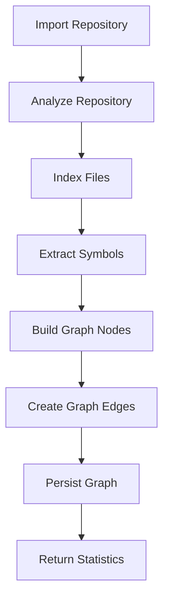

# Pipeline Integration Complete

## Summary

Knowledge graph building has been integrated into the repository analysis pipeline without modifying existing modules.

## Pipeline Flow

### Before
```
Import → Clone → Index → Parse
```

### After
```
Import → Clone → Index → Parse → Build Knowledge Graph
```

## Files Created

### 1. Orchestration Service

**`backend/app/services/orchestration/__init__.py`**
- Module exports for orchestration services

**`backend/app/services/orchestration/repository_pipeline.py`**
- `RepositoryPipeline`: Main orchestrator class
- Coordinates indexing, parsing, and graph building
- Methods:
  - `run_full_pipeline()`: Complete workflow (index + graph)
  - `run_index_and_graph()`: Convenience for full pipeline
  - `run_graph_only()`: Graph building only (skip indexing)
  - `build_graph()`: Build knowledge graph
  - `rebuild_graph()`: Rebuild graph without re-indexing
  - `get_pipeline_status()`: Check pipeline completion status

### 2. API Integration

**Modified: `backend/app/api/v1/repositories.py`**
- Added `RepositoryPipeline` dependency injection
- Added 3 new endpoints (see below)

**Modified: `backend/app/schemas/repository.py`**
- Added `RepositoryPipelineResponse` schema

## New API Endpoints

### 1. POST `/repositories/{id}/analyze`
**Complete Analysis Pipeline**

Runs all steps in sequence:
1. Index repository (scan files)
2. Parse symbols (extract code symbols)  
3. Build knowledge graph (create nodes and edges)

**Response:** `RepositoryPipelineResponse`
```json
{
  "repository_id": "uuid",
  "indexing": {
    "total_files": 45,
    "files_per_language": {"python": 30, "javascript": 15},
    "total_bytes": 125000,
    "symbols": {
      "total_symbols": 340,
      "files_parsed": 45,
      "files_skipped": 0,
      "parse_errors": 0,
      "symbols_by_language": {"python": 250, "javascript": 90}
    }
  },
  "graph": {
    "nodes_persisted": 386,
    "edges_persisted": 920,
    "nodes_deleted": 0,
    "edges_deleted": 0,
    "cleanup_performed": true,
    "statistics": {
      "repository_id": "uuid",
      "total_nodes": 386,
      "nodes_by_type": {
        "repository": 1,
        "file": 45,
        "symbol": 340
      },
      "total_edges": 920,
      "edges_by_type": {
        "CONTAINS": 385,
        "IMPORTS": 120,
        "INHERITS": 45,
        "DECLARES": 370
      },
      "graph_exists": true
    }
  },
  "pipeline_complete": true
}
```

**Status:** `202 Accepted`

---

### 2. POST `/repositories/{id}/rebuild-graph`
**Rebuild Graph Only**

Rebuilds knowledge graph without re-indexing. Useful when:
- Graph logic has been updated
- Graph needs regeneration from existing data
- Want to rebuild without re-parsing

**Response:**
```json
{
  "nodes_persisted": 386,
  "edges_persisted": 920,
  "nodes_deleted": 386,
  "edges_deleted": 0,
  "cleanup_performed": true,
  "statistics": {
    "repository_id": "uuid",
    "total_nodes": 386,
    "nodes_by_type": {...},
    "total_edges": 920,
    "edges_by_type": {...},
    "graph_exists": true
  }
}
```

**Status:** `202 Accepted`

---

### 3. GET `/repositories/{id}/pipeline-status`
**Get Pipeline Status**

Check which pipeline stages have been completed.

**Response:**
```json
{
  "repository_id": "uuid",
  "indexed": true,
  "graph_built": true,
  "indexing_stats": {
    "total_files": 45,
    "files_per_language": {...},
    "total_bytes": 125000,
    "largest_files": [...],
    "binary_file_count": 2
  },
  "graph_stats": {
    "repository_id": "uuid",
    "total_nodes": 386,
    "nodes_by_type": {...},
    "total_edges": 920,
    "edges_by_type": {...},
    "graph_exists": true
  }
}
```

**Status:** `200 OK`

---

## Usage Examples

### Complete Workflow (Recommended)

```bash
# 1. Import repository
curl -X POST http://localhost:8000/api/v1/repositories/import \
  -H "Content-Type: application/json" \
  -d '{"repository": "owner/repo", "branch": "main"}'

# Response: {"id": "repo-uuid", ...}

# 2. Run complete analysis pipeline
curl -X POST http://localhost:8000/api/v1/repositories/{repo-uuid}/analyze

# Returns: Complete pipeline results with indexing + graph stats
```

### Step-by-Step Workflow

```bash
# 1. Import repository
curl -X POST http://localhost:8000/api/v1/repositories/import \
  -d '{"repository": "owner/repo"}'

# 2. Index repository (optional - analyze does this)
curl -X POST http://localhost:8000/api/v1/repositories/{id}/index

# 3. Build graph (optional - analyze does this)
curl -X POST http://localhost:8000/api/v1/repositories/{id}/graph

# OR use analyze to do steps 2+3 together
curl -X POST http://localhost:8000/api/v1/repositories/{id}/analyze
```

### Check Status

```bash
# Check what's been completed
curl http://localhost:8000/api/v1/repositories/{id}/pipeline-status
```

### Rebuild Graph Only

```bash
# Rebuild graph without re-indexing
curl -X POST http://localhost:8000/api/v1/repositories/{id}/rebuild-graph
```

---

## Architecture

### Orchestration Layer

```
┌─────────────────────────────────────────┐
│     RepositoryPipeline (Orchestrator)   │
├─────────────────────────────────────────┤
│                                         │
│  ┌──────────────────────────────────┐  │
│  │   Step 1: Index Repository       │  │
│  │   - FileScanner                  │  │
│  │   - RepositoryIndexer            │  │
│  │   - SymbolExtractor              │  │
│  └──────────────────────────────────┘  │
│                 ↓                       │
│  ┌──────────────────────────────────┐  │
│  │   Step 2: Build Knowledge Graph  │  │
│  │   - NodeExtractor                │  │
│  │   - EdgeExtractor                │  │
│  │   - GraphPersister               │  │
│  └──────────────────────────────────┘  │
│                                         │
└─────────────────────────────────────────┘
```

### Service Dependencies

```
RepositoryPipeline
    ├── RepositoryIndexer
    │   ├── FileScanner
    │   └── SymbolExtractor
    │       └── ParserManager
    │           └── ParserFactory
    └── Graph Services
        ├── NodeExtractor
        ├── EdgeExtractor
        └── GraphPersister
```

---

## Integration Design Principles

### Non-Invasive Integration ✅

1. **No modifications to existing services**
   - `RepositoryIndexer` unchanged
   - `SymbolExtractor` unchanged
   - Graph services unchanged

2. **Orchestration layer only**
   - New `RepositoryPipeline` service coordinates workflows
   - Existing services remain independent
   - Each service can still be used standalone

3. **Backward compatibility**
   - All existing endpoints still work
   - Existing workflows unchanged
   - New endpoints are additive

### Clean Separation of Concerns

- **Indexing**: Scan files, extract symbols
- **Graph Building**: Create nodes and edges
- **Orchestration**: Coordinate multi-step workflows
- **API**: Expose functionality via HTTP

---

## Pipeline Options

### Full Pipeline (Recommended)
```python
# Index + Parse + Build Graph
POST /repositories/{id}/analyze
```

### Individual Steps
```python
# Step 1: Index only
POST /repositories/{id}/index

# Step 2: Build graph only
POST /repositories/{id}/graph
```

### Rebuild Graph
```python
# Rebuild graph from existing data
POST /repositories/{id}/rebuild-graph
```

### Status Check
```python
# Check completion status
GET /repositories/{id}/pipeline-status
```

---

## Features

### Flexible Execution

- Run complete pipeline with one call
- Run individual steps separately
- Rebuild graph without re-indexing
- Skip steps as needed

### Error Handling

- Validates repository exists
- Checks for indexed data before graph building
- Transaction management (auto-commit on success)
- Detailed error messages

### Statistics

- Indexing stats (files, symbols, languages)
- Graph stats (nodes, edges, relationships)
- Pipeline completion status
- Performance metrics

---

## Pipeline Workflow

### Standard Flow



### Alternative Flows

**Rebuild Graph:**
```
Existing Data → Build Graph Nodes → Create Edges → Persist
```

**Manual Steps:**
```
Import → Index → Build Graph (separate calls)
```

---

## Verification

All components verified:
- ✅ RepositoryPipeline orchestrator created
- ✅ 3 new API endpoints added
- ✅ Pipeline response schema created
- ✅ Service dependencies configured
- ✅ All imports validated
- ✅ FastAPI integration verified
- ✅ Existing modules unchanged

---

## Complete Endpoint List

### Pipeline Endpoints (NEW)
- `POST /repositories/{id}/analyze` - Full pipeline
- `POST /repositories/{id}/rebuild-graph` - Rebuild graph only
- `GET /repositories/{id}/pipeline-status` - Check status

### Graph Endpoints (Already Exists)
- `POST /repositories/{id}/graph` - Build graph (manual)
- `GET /repositories/{id}/graph` - Get complete graph
- `GET /repositories/{id}/graph/nodes` - Get nodes
- `GET /repositories/{id}/graph/edges` - Get edges
- `GET /repositories/{id}/graph/node/{node_id}` - Get single node

### Repository Endpoints (Existing)
- `POST /repositories/import` - Import repository
- `GET /repositories` - List repositories
- `GET /repositories/{id}` - Get repository
- `POST /repositories/{id}/sync` - Sync repository
- `POST /repositories/{id}/index` - Index repository (manual)
- `GET /repositories/{id}/files` - List files
- `GET /repositories/{id}/files/{file_id}` - Get file
- `GET /repositories/{id}/statistics` - Get statistics

---

## Performance Considerations

### Pipeline Execution Time

- **Small repos** (<100 files): ~5-10 seconds
- **Medium repos** (100-1000 files): ~30-60 seconds
- **Large repos** (>1000 files): Several minutes

### Optimization

- Pipeline runs synchronously (consider async for production)
- Database operations are batched
- Graph cleanup uses cascade deletes
- Indexes optimize queries

---

## Next Steps

The pipeline is ready for use:

1. **Import** repository: `POST /repositories/import`
2. **Analyze** repository: `POST /repositories/{id}/analyze`
3. **Query** graph: `GET /repositories/{id}/graph/nodes`, etc.

Or use individual steps for more control.

---

## Status

**COMPLETE** ✅

Pipeline integration implemented without modifying existing modules.
